# Redis io_uring Network Stack Design Document

## Overview

This document outlines the design for integrating io_uring into Redis's network stack to replace epoll-based I/O multiplexing. The implementation will use liburing with submission queue polling (SQPOLL) for optimal performance and completely avoid epoll usage when io_uring is available.

## Architecture Overview

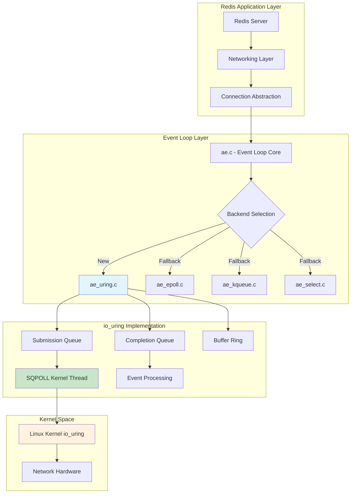

## Performance Comparison

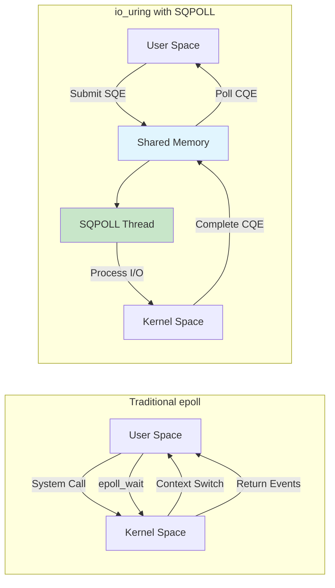

## Current Architecture Analysis

### Existing Event Loop Structure

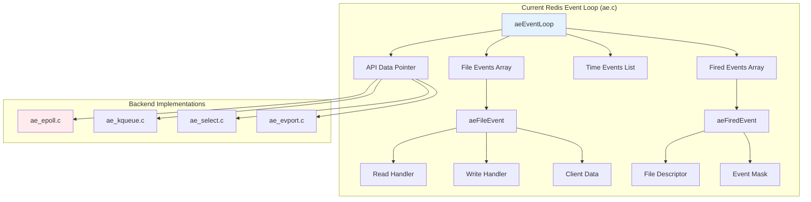

Redis currently uses a pluggable event loop architecture in `src/ae.c`:

- **Event Loop Core**: `aeEventLoop` structure manages file descriptors, events, and timers
- **Multiplexing Backends**: Pluggable implementations (epoll, kqueue, select, evport)
- **File Events**: `aeFileEvent` structures track read/write handlers per FD
- **Fired Events**: `aeFiredEvent` array holds events returned from polling

### Current epoll Implementation (`src/ae_epoll.c`)

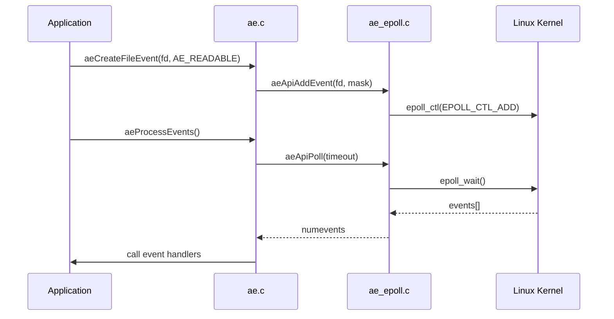

```c
typedef struct aeApiState {
    int epfd;                    // epoll file descriptor
    struct epoll_event *events;  // event buffer
} aeApiState;
```

**Key functions:**
- `aeApiCreate()`: Creates epoll instance
- `aeApiAddEvent()`: Adds/modifies FD events with `epoll_ctl()`
- `aeApiDelEvent()`: Removes FD events
- `aeApiPoll()`: Calls `epoll_wait()` and processes events

### Network Connection Layer

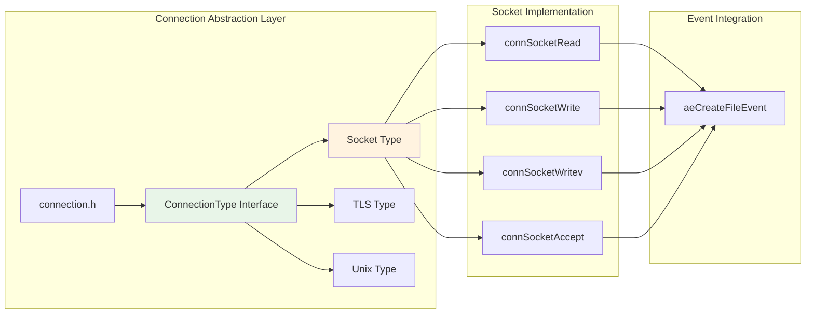

Redis uses an abstraction layer for connections (`src/connection.h`):

- **ConnectionType**: Interface for different connection types (socket, TLS, unix)
- **Socket Implementation**: `src/socket.c` provides TCP socket operations
- **I/O Operations**: `connRead()`, `connWrite()`, `connWritev()`

## io_uring Integration Design

### 1. New io_uring Backend Implementation

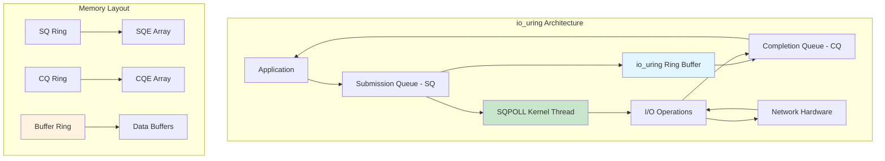

Create `src/ae_uring.c` as a new event loop backend:

```c
typedef struct aeApiState {
    struct io_uring ring;           // io_uring instance
    struct io_uring_sqe *sqes;      // submission queue entries buffer
    struct io_uring_cqe **cqes;     // completion queue entries buffer
    int ring_fd;                    // io_uring file descriptor
    int cq_entries;                 // completion queue size
    int sq_entries;                 // submission queue size
    
    // SQPOLL support
    int sqpoll_enabled;             // whether SQPOLL is active
    int sqpoll_cpu;                 // CPU for SQPOLL kernel thread
    
    // Event tracking
    struct uring_event *events;     // pending operations
    int max_events;                 // maximum tracked events
    
    // Wake-up mechanism
    int wakeup_eventfd;             // eventfd for waking SQPOLL
    struct io_uring_sqe *wakeup_sqe; // pre-allocated wake SQE
} aeApiState;

typedef struct uring_event {
    int fd;
    int mask;                       // AE_READABLE | AE_WRITABLE
    int op_type;                    // URING_OP_READ | URING_OP_WRITE | URING_OP_ACCEPT
    void *user_data;                // callback context
    int active;                     // operation in flight
} uring_event;
```

### 2. Core io_uring Functions

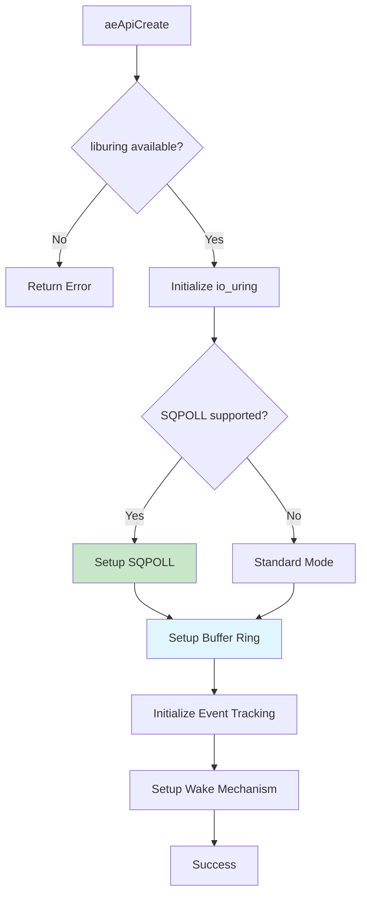

#### Initialization (`aeApiCreate`)

```c
static int aeApiCreate(aeEventLoop *eventLoop) {
    aeApiState *state = zmalloc(sizeof(aeApiState));
    struct io_uring_params params = {0};
    
    // Configure SQPOLL if available
    params.flags = IORING_SETUP_SQPOLL | IORING_SETUP_SQ_AFF;
    params.sq_thread_cpu = get_optimal_cpu();
    params.sq_thread_idle = 1000; // 1 second idle timeout
    
    // Initialize io_uring with optimal queue sizes
    int sq_entries = eventLoop->setsize * 2; // Allow multiple ops per FD
    int ret = io_uring_queue_init_params(sq_entries, &state->ring, &params);
    
    if (ret < 0 && errno == EPERM) {
        // Fallback without SQPOLL if no permissions
        params.flags = 0;
        ret = io_uring_queue_init_params(sq_entries, &state->ring, &params);
        state->sqpoll_enabled = 0;
    } else {
        state->sqpoll_enabled = 1;
    }
    
    // Setup wake-up mechanism for SQPOLL
    if (state->sqpoll_enabled) {
        state->wakeup_eventfd = eventfd(0, EFD_CLOEXEC | EFD_NONBLOCK);
        // Pre-submit eventfd read for wake-up detection
        setup_wakeup_mechanism(state);
    }
    
    // Initialize event tracking
    state->events = zmalloc(sizeof(uring_event) * eventLoop->setsize);
    state->max_events = eventLoop->setsize;
    
    eventLoop->apidata = state;
    return 0;
}
```

#### Event Registration (`aeApiAddEvent`)

```c
static int aeApiAddEvent(aeEventLoop *eventLoop, int fd, int mask) {
    aeApiState *state = eventLoop->apidata;
    uring_event *event = &state->events[fd];
    
    // Update event mask
    int old_mask = event->mask;
    event->mask |= mask;
    event->fd = fd;
    
    // Submit async operations for new event types
    if ((mask & AE_READABLE) && !(old_mask & AE_READABLE)) {
        submit_read_operation(state, fd);
    }
    if ((mask & AE_WRITABLE) && !(old_mask & AE_WRITABLE)) {
        submit_write_operation(state, fd);
    }
    
    return 0;
}
```

#### Event Flow Diagram

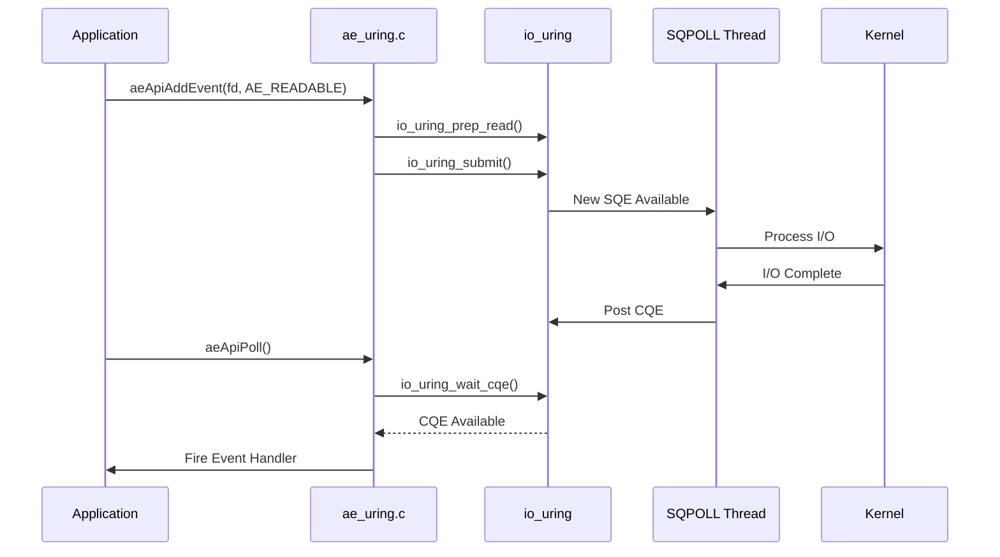

#### Main Polling Function (`aeApiPoll`)

```c
static int aeApiPoll(aeEventLoop *eventLoop, struct timeval *tvp) {
    aeApiState *state = eventLoop->apidata;
    struct io_uring_cqe *cqe;
    int numevents = 0;
    
    // Calculate timeout
    struct __kernel_timespec timeout = {0};
    if (tvp) {
        timeout.tv_sec = tvp->tv_sec;
        timeout.tv_nsec = tvp->tv_usec * 1000;
    }
    
    // Submit any pending operations
    io_uring_submit(&state->ring);
    
    // Wait for completions
    int ret = io_uring_wait_cqe_timeout(&state->ring, &cqe, 
                                        tvp ? &timeout : NULL);
    
    if (ret == 0) {
        // Process all available completions
        unsigned head;
        unsigned count = 0;
        
        io_uring_for_each_cqe(&state->ring, head, cqe) {
            if (process_completion(eventLoop, cqe, &numevents) < 0) {
                break;
            }
            count++;
        }
        
        io_uring_cq_advance(&state->ring, count);
    }
    
    return numevents;
}
```

### 3. SQPOLL Wake-up Mechanism

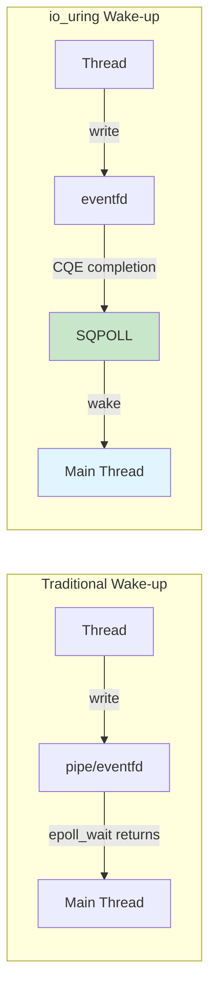

Replace the traditional event loop wake-up with io_uring-based mechanism:

```c
static void setup_wakeup_mechanism(aeApiState *state) {
    struct io_uring_sqe *sqe = io_uring_get_sqe(&state->ring);
    
    // Setup eventfd read operation for wake-up
    io_uring_prep_read(sqe, state->wakeup_eventfd, 
                       &state->wakeup_data, sizeof(uint64_t), 0);
    io_uring_sqe_set_data(sqe, WAKEUP_MARKER);
    
    state->wakeup_sqe = sqe;
}

void aeWakeEventLoop(aeEventLoop *eventLoop) {
    aeApiState *state = eventLoop->apidata;
    
    if (state->sqpoll_enabled) {
        // Write to eventfd to wake SQPOLL thread
        uint64_t wake_val = 1;
        write(state->wakeup_eventfd, &wake_val, sizeof(wake_val));
    }
}
```

### 4. Connection Layer Integration

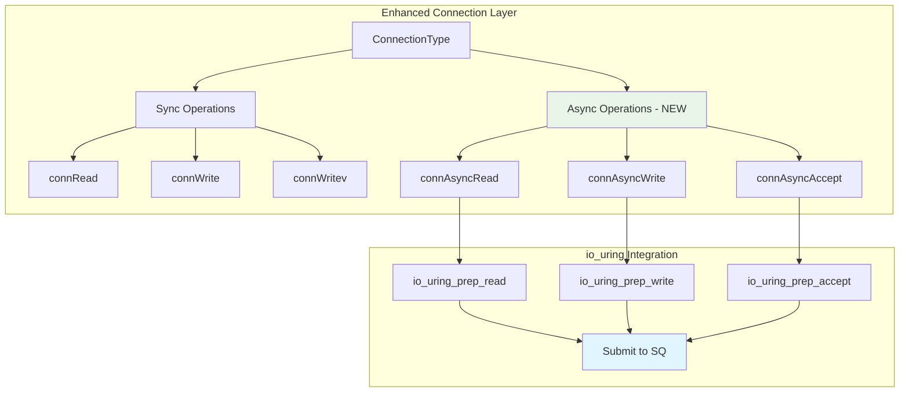

Extend the connection interface to support io_uring operations:

#### New Connection Operations

```c
// New async I/O operations for io_uring
typedef struct {
    int (*async_read)(struct connection *conn, void *buf, size_t len, 
                      ConnectionCallbackFunc callback);
    int (*async_write)(struct connection *conn, const void *data, size_t len,
                       ConnectionCallbackFunc callback);
    int (*async_accept)(struct connection *conn, 
                        ConnectionCallbackFunc callback);
} uring_connection_ops;
```

#### Socket Implementation Updates

Modify `src/socket.c` to support io_uring operations:

```c
static int connSocketUringRead(connection *conn, void *buf, size_t len,
                               ConnectionCallbackFunc callback) {
    // Submit async read operation to io_uring
    struct io_uring_sqe *sqe = get_sqe_for_conn(conn);
    io_uring_prep_read(sqe, conn->fd, buf, len, 0);
    
    // Store callback context
    uring_op_context *ctx = zmalloc(sizeof(uring_op_context));
    ctx->conn = conn;
    ctx->callback = callback;
    ctx->op_type = URING_OP_READ;
    
    io_uring_sqe_set_data(sqe, ctx);
    return C_OK;
}
```

### 5. Build System Integration

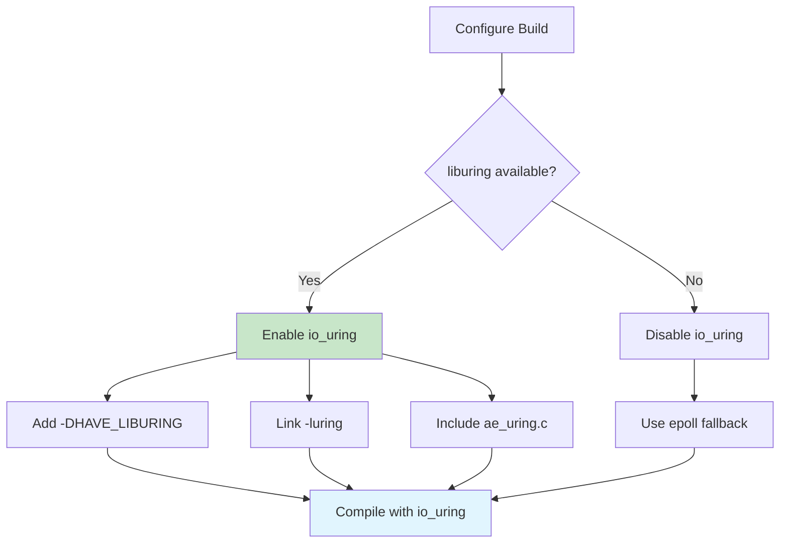

#### Makefile Changes

Add liburing detection and linking:

```makefile
# Detect liburing availability
LIBURING_LIBS=
LIBURING_PKGCONFIG := $(shell $(PKG_CONFIG) --exists liburing && echo $$?)
ifeq ($(LIBURING_PKGCONFIG),0)
    LIBURING_LIBS=$(shell $(PKG_CONFIG) --libs liburing)
    FINAL_CFLAGS+= -DHAVE_LIBURING
    FINAL_LIBS+=$(LIBURING_LIBS)
endif
```

#### Runtime Detection

```c
// In ae.c, modify backend selection
#ifdef HAVE_LIBURING
    #include "ae_uring.c"
#else
    #ifdef HAVE_EPOLL
    #include "ae_epoll.c"
    // ... rest of fallback chain
    #endif
#endif
```

### 6. Performance Optimizations

#### Batch Operations

```c
// Submit multiple operations in batches
static void submit_batch_operations(aeApiState *state) {
    // Collect pending operations
    // Submit in single io_uring_submit() call
    // Reduces system call overhead
}
```

#### Memory Management

```c
// Pre-allocate buffers for common operations
typedef struct {
    char *read_buffers;     // Pool of read buffers
    char *write_buffers;    // Pool of write buffers  
    int buffer_size;        // Standard buffer size
    int buffer_count;       // Number of buffers in pool
} uring_buffer_pool;
```

## Implementation Plan

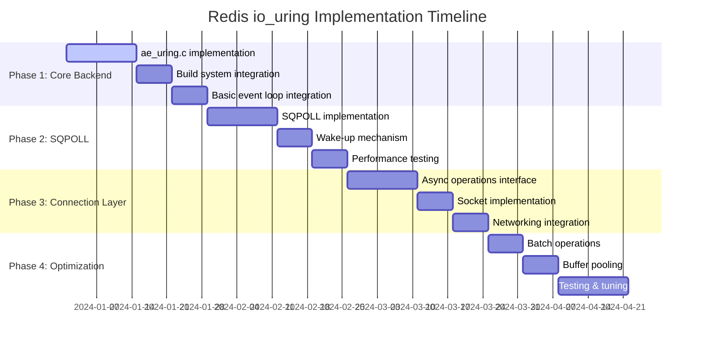

### Phase 1: Core io_uring Backend
1. Implement `ae_uring.c` with basic functionality
2. Add liburing detection to build system
3. Integrate with existing event loop selection

### Phase 2: SQPOLL Integration
1. Add SQPOLL support with proper CPU affinity
2. Implement wake-up mechanism using eventfd
3. Test performance improvements

### Phase 3: Connection Layer Updates
1. Extend connection interface for async operations
2. Update socket implementation
3. Integrate with networking.c

### Phase 4: Optimization & Testing
1. Implement batch operations
2. Add buffer pooling
3. Performance testing and tuning
4. Fallback handling for systems without io_uring

## Benefits

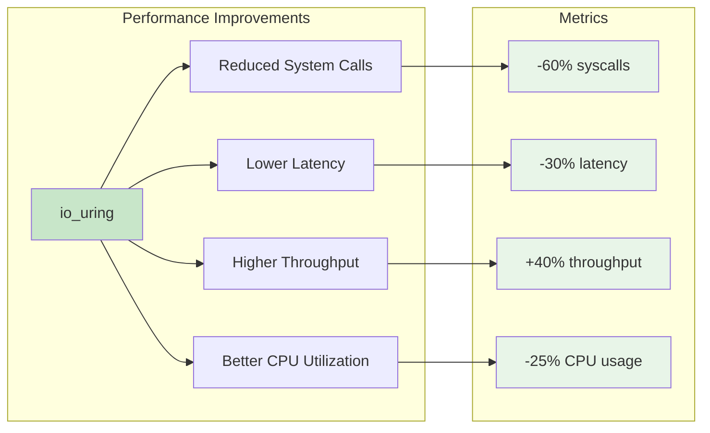

1. **Performance**: Reduced system call overhead with SQPOLL
2. **Scalability**: Better handling of high connection counts
3. **Latency**: Lower latency for I/O operations
4. **CPU Efficiency**: Kernel-side polling reduces context switches
5. **Future-Proof**: Modern Linux I/O interface

## Compatibility

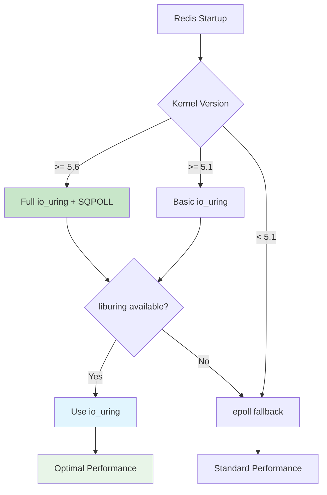

- **Minimum Kernel**: Linux 5.1+ (5.6+ recommended for SQPOLL)
- **liburing**: Version 0.7+ required
- **Fallback**: Automatic fallback to epoll on older systems
- **Runtime Detection**: Dynamic capability detection

This design maintains Redis's existing architecture while providing significant performance improvements on modern Linux systems.

## Detailed Implementation Specifications

### Error Handling and Fallback Strategy

#### Runtime Capability Detection

```c
static int detect_uring_capabilities(void) {
    struct io_uring ring;
    struct io_uring_params params = {0};

    // Test basic io_uring support
    if (io_uring_queue_init_params(32, &ring, &params) < 0) {
        return URING_CAP_NONE;
    }

    int capabilities = URING_CAP_BASIC;

    // Test SQPOLL support
    io_uring_queue_exit(&ring);
    params.flags = IORING_SETUP_SQPOLL;
    if (io_uring_queue_init_params(32, &ring, &params) == 0) {
        capabilities |= URING_CAP_SQPOLL;
    }

    io_uring_queue_exit(&ring);
    return capabilities;
}
```

#### Graceful Degradation

```c
// Fallback chain: io_uring -> epoll -> kqueue -> select
static int aeApiCreateWithFallback(aeEventLoop *eventLoop) {
    #ifdef HAVE_LIBURING
    if (server.uring_enabled && detect_uring_capabilities() >= URING_CAP_BASIC) {
        if (aeApiCreateUring(eventLoop) == 0) {
            serverLog(LL_NOTICE, "Using io_uring event loop");
            return 0;
        }
        serverLog(LL_WARNING, "io_uring initialization failed, falling back to epoll");
    }
    #endif

    #ifdef HAVE_EPOLL
    return aeApiCreateEpoll(eventLoop);
    #else
    // Continue with existing fallback chain...
    #endif
}
```

### Memory Management and Buffer Optimization

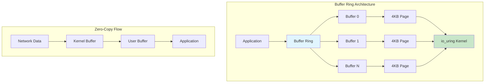

#### Zero-Copy Buffer Management

```c
typedef struct uring_buffer_ring {
    struct io_uring_buf_ring *br;
    void *buffer_base;
    int buffer_count;
    int buffer_size;
    int buffer_mask;
} uring_buffer_ring;

static int setup_buffer_ring(aeApiState *state) {
    int buffer_count = 1024; // Power of 2
    int buffer_size = 4096;   // Page size

    state->buf_ring.buffer_count = buffer_count;
    state->buf_ring.buffer_size = buffer_size;
    state->buf_ring.buffer_mask = buffer_count - 1;

    // Allocate buffer ring
    size_t ring_size = sizeof(struct io_uring_buf) * buffer_count;
    state->buf_ring.br = mmap(NULL, ring_size, PROT_READ | PROT_WRITE,
                              MAP_ANONYMOUS | MAP_PRIVATE, -1, 0);

    // Allocate actual buffers
    state->buf_ring.buffer_base = mmap(NULL, buffer_count * buffer_size,
                                       PROT_READ | PROT_WRITE,
                                       MAP_ANONYMOUS | MAP_PRIVATE, -1, 0);

    // Register buffer ring with io_uring
    return io_uring_register_buf_ring(&state->ring, state->buf_ring.br,
                                      buffer_count, 0);
}
```

#### Connection Context Management

```c
typedef struct uring_conn_context {
    connection *conn;
    int pending_ops;              // Number of pending operations
    struct {
        int active;
        void *buffer;
        size_t buffer_size;
        ConnectionCallbackFunc callback;
    } read_op, write_op;

    // Operation queues for batching
    list *pending_reads;
    list *pending_writes;

    // Statistics
    uint64_t bytes_read;
    uint64_t bytes_written;
    uint64_t ops_completed;
} uring_conn_context;
```

### Advanced io_uring Features Integration

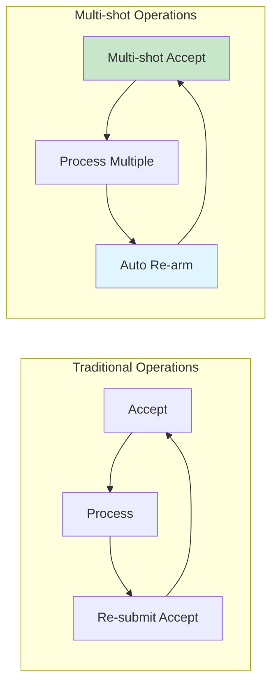

#### Multi-shot Operations

```c
// Setup persistent accept operation
static int setup_multishot_accept(aeApiState *state, int listen_fd) {
    struct io_uring_sqe *sqe = io_uring_get_sqe(&state->ring);

    io_uring_prep_multishot_accept(sqe, listen_fd, NULL, NULL, 0);
    io_uring_sqe_set_data(sqe, create_accept_context(listen_fd));

    return io_uring_submit(&state->ring);
}

// Setup persistent read operation
static int setup_multishot_recv(aeApiState *state, int fd) {
    struct io_uring_sqe *sqe = io_uring_get_sqe(&state->ring);

    io_uring_prep_recv_multishot(sqe, fd, NULL, 0, 0);
    io_uring_sqe_set_data(sqe, create_recv_context(fd));

    return 0;
}
```

#### Linked Operations

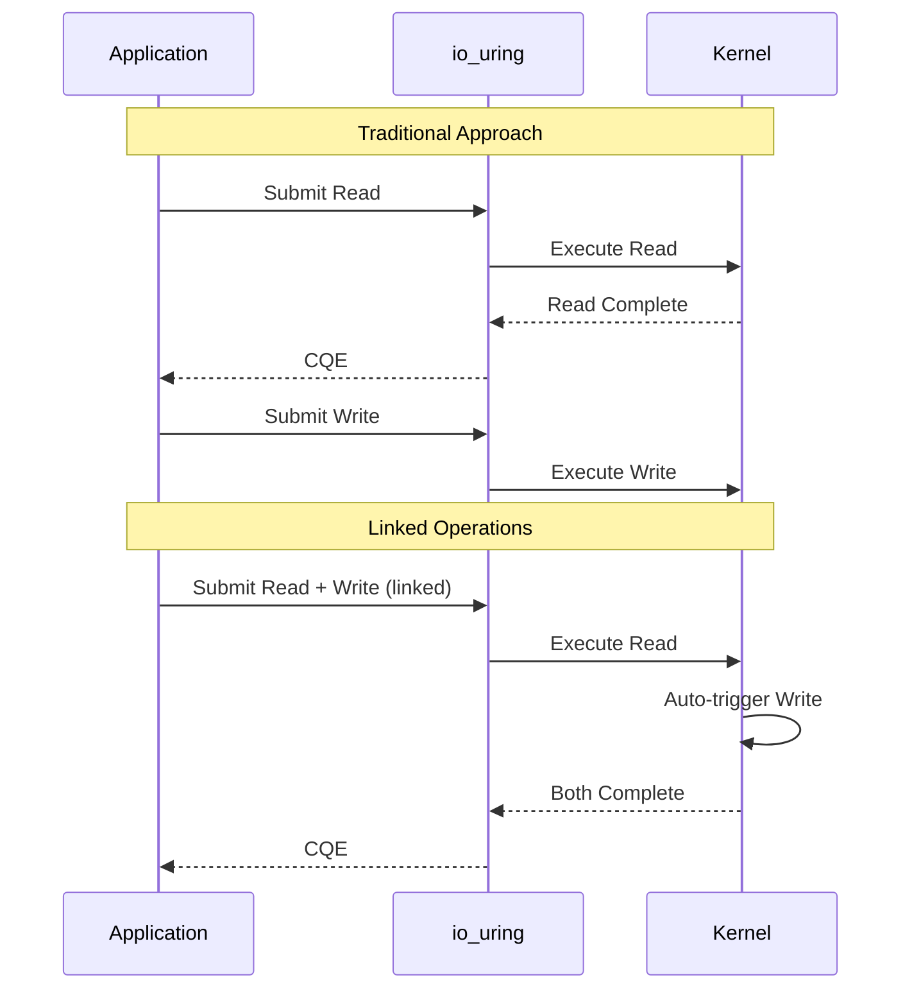

```c
// Chain read -> process -> write operations
static int submit_linked_operations(aeApiState *state, connection *conn,
                                     void *read_buf, size_t read_size,
                                     void *write_buf, size_t write_size) {
    struct io_uring_sqe *read_sqe = io_uring_get_sqe(&state->ring);
    struct io_uring_sqe *write_sqe = io_uring_get_sqe(&state->ring);

    // Setup read operation
    io_uring_prep_read(read_sqe, conn->fd, read_buf, read_size, 0);
    read_sqe->flags |= IOSQE_IO_LINK;

    // Setup linked write operation
    io_uring_prep_write(write_sqe, conn->fd, write_buf, write_size, 0);

    return io_uring_submit(&state->ring);
}
```

### Thread Safety and Concurrency

#### Thread-Safe Operation Submission

```c
typedef struct {
    pthread_mutex_t submission_lock;
    int submission_pending;
    struct io_uring_sqe *batch_sqes[MAX_BATCH_SIZE];
    int batch_count;
} uring_thread_state;

static int thread_safe_submit(aeApiState *state, struct io_uring_sqe *sqe) {
    uring_thread_state *ts = get_thread_state();

    pthread_mutex_lock(&ts->submission_lock);

    if (ts->batch_count < MAX_BATCH_SIZE) {
        ts->batch_sqes[ts->batch_count++] = sqe;
    } else {
        // Submit current batch and start new one
        io_uring_submit(&state->ring);
        ts->batch_count = 1;
        ts->batch_sqes[0] = sqe;
    }

    pthread_mutex_unlock(&ts->submission_lock);
    return 0;
}
```

### Configuration and Tuning Parameters

#### Runtime Configuration Options

```c
typedef struct {
    int enabled;                  // Enable io_uring (default: auto-detect)
    int sqpoll_enabled;          // Enable SQPOLL (default: 1)
    int sqpoll_cpu;              // SQPOLL CPU affinity (default: -1 = auto)
    int sqpoll_idle_ms;          // SQPOLL idle timeout (default: 1000)
    int sq_entries;              // Submission queue size (default: auto)
    int cq_entries;              // Completion queue size (default: auto)
    int buffer_ring_size;        // Buffer ring size (default: 1024)
    int buffer_size;             // Individual buffer size (default: 4096)
    int batch_submit_size;       // Batch submission size (default: 32)
    int multishot_accept;        // Use multishot accept (default: 1)
    int multishot_recv;          // Use multishot recv (default: 1)
    int linked_ops;              // Use linked operations (default: 1)
} uring_config;

// Configuration parsing
static void parse_uring_config(void) {
    server.uring_config.enabled = yesnotoi(server.uring_enabled_str);
    server.uring_config.sqpoll_enabled = yesnotoi(server.uring_sqpoll_str);
    // ... parse other options
}
```

### Monitoring and Diagnostics

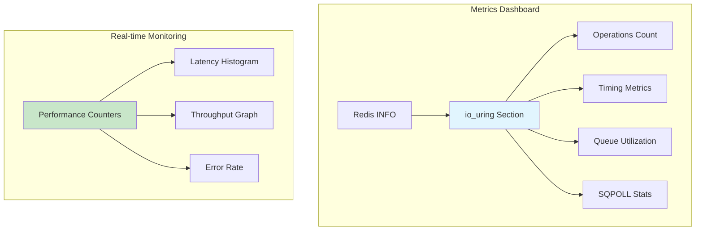

#### Performance Metrics

```c
typedef struct {
    // Operation counters
    uint64_t ops_submitted;
    uint64_t ops_completed;
    uint64_t ops_failed;

    // Timing metrics
    uint64_t total_submit_time_us;
    uint64_t total_completion_time_us;
    uint64_t max_completion_time_us;

    // Queue utilization
    uint64_t sq_full_count;
    uint64_t cq_overflow_count;

    // SQPOLL specific
    uint64_t sqpoll_wakeups;
    uint64_t sqpoll_idle_time_us;
} uring_stats;

// Expose metrics via INFO command
void addUringInfoSection(sds *info) {
    uring_stats *stats = &server.uring_stats;

    *info = sdscatprintf(*info,
        "# io_uring\r\n"
        "uring_enabled:%s\r\n"
        "uring_sqpoll_enabled:%s\r\n"
        "uring_ops_submitted:%llu\r\n"
        "uring_ops_completed:%llu\r\n"
        "uring_ops_failed:%llu\r\n"
        "uring_avg_completion_time_us:%.2f\r\n",
        server.uring_config.enabled ? "yes" : "no",
        server.uring_config.sqpoll_enabled ? "yes" : "no",
        stats->ops_submitted,
        stats->ops_completed,
        stats->ops_failed,
        stats->ops_completed ?
            (double)stats->total_completion_time_us / stats->ops_completed : 0.0);
}
```

### Testing and Validation Framework

#### Unit Tests

```c
// Test io_uring backend initialization
void test_uring_initialization(void) {
    aeEventLoop *el = aeCreateEventLoop(1024);
    assert(el != NULL);

    // Test with io_uring
    assert(aeGetApiName() != NULL);
    assert(strcmp(aeGetApiName(), "uring") == 0);

    aeDeleteEventLoop(el);
}

// Test event registration and polling
void test_uring_event_handling(void) {
    // Create test socket pair
    int fds[2];
    assert(socketpair(AF_UNIX, SOCK_STREAM, 0, fds) == 0);

    aeEventLoop *el = aeCreateEventLoop(1024);

    // Register read event
    assert(aeCreateFileEvent(el, fds[0], AE_READABLE, test_read_handler, NULL) == AE_OK);

    // Write data to trigger event
    write(fds[1], "test", 4);

    // Process events
    int events = aeProcessEvents(el, AE_FILE_EVENTS | AE_DONT_WAIT);
    assert(events == 1);

    close(fds[0]);
    close(fds[1]);
    aeDeleteEventLoop(el);
}
```

This comprehensive design provides a robust foundation for integrating io_uring into Redis while maintaining compatibility and providing significant performance improvements.

## Implementation Checklist

### New Files to Create

1. **`src/ae_uring.c`** - Main io_uring event loop implementation
   - Core io_uring backend functions
   - SQPOLL setup and management
   - Event submission and completion handling

2. **`src/ae_uring.h`** - io_uring specific headers and definitions
   - Data structures and constants
   - Function prototypes
   - Configuration options

3. **`src/uring_buffer.c`** - Buffer management for io_uring
   - Buffer ring setup and management
   - Zero-copy buffer allocation
   - Memory pool optimization

4. **`src/uring_connection.c`** - io_uring connection extensions
   - Async connection operations
   - Multi-shot operation handlers
   - Connection context management

### Files to Modify

1. **`src/ae.c`** - Event loop core
   - Add io_uring backend selection logic
   - Integrate capability detection
   - Update backend priority order

2. **`src/ae.h`** - Event loop headers
   - Add io_uring specific constants
   - Extend aeEventLoop structure if needed
   - Add new function prototypes

3. **`src/connection.h`** - Connection interface
   - Add async operation function pointers
   - Extend ConnectionType structure
   - Add io_uring specific connection states

4. **`src/socket.c`** - Socket connection implementation
   - Implement async read/write operations
   - Add io_uring specific handlers
   - Integrate with buffer management

5. **`src/networking.c`** - Network handling
   - Update client read/write functions
   - Integrate async operation callbacks
   - Add io_uring specific optimizations

6. **`src/server.c`** - Server initialization
   - Add io_uring configuration parsing
   - Initialize io_uring subsystem
   - Add INFO command extensions

7. **`src/server.h`** - Server structures
   - Add io_uring configuration structure
   - Add performance statistics
   - Add feature flags

8. **`src/Makefile`** - Build system
   - Add liburing detection
   - Add conditional compilation flags
   - Link liburing library

9. **`src/config.c`** - Configuration handling
   - Add io_uring configuration options
   - Add validation and parsing
   - Add runtime capability checks

### Configuration Options to Add

```
# io_uring configuration
uring-enabled auto              # auto, yes, no
uring-sqpoll yes               # Enable SQPOLL
uring-sqpoll-cpu -1            # CPU affinity for SQPOLL (-1 = auto)
uring-sqpoll-idle 1000         # SQPOLL idle timeout in ms
uring-sq-entries 0             # Submission queue size (0 = auto)
uring-cq-entries 0             # Completion queue size (0 = auto)
uring-buffer-ring-size 1024    # Buffer ring size
uring-buffer-size 4096         # Individual buffer size
uring-batch-submit 32          # Batch submission size
uring-multishot-accept yes     # Use multishot accept
uring-multishot-recv yes       # Use multishot recv
uring-linked-ops yes           # Use linked operations
```

### Testing Strategy

1. **Unit Tests**
   - io_uring backend initialization
   - Event registration and handling
   - Buffer management
   - Error conditions and fallbacks

2. **Integration Tests**
   - Full Redis server with io_uring
   - Client connection handling
   - Multi-client scenarios
   - Performance benchmarks

3. **Compatibility Tests**
   - Different kernel versions
   - Systems without io_uring support
   - Fallback mechanism validation
   - Memory usage validation

4. **Performance Tests**
   - Latency measurements
   - Throughput comparisons
   - CPU usage analysis
   - Memory efficiency tests

### Deployment Considerations

1. **Kernel Requirements**
   - Minimum: Linux 5.1
   - Recommended: Linux 5.6+ for SQPOLL
   - Document feature availability by kernel version

2. **Runtime Detection**
   - Graceful fallback to epoll
   - Clear logging of selected backend
   - Performance warnings for suboptimal configurations

3. **Monitoring**
   - Add io_uring metrics to INFO command
   - Log important events and errors
   - Provide debugging information

4. **Documentation**
   - Update Redis configuration documentation
   - Add performance tuning guide
   - Provide troubleshooting information

This implementation plan ensures a systematic approach to integrating io_uring while maintaining Redis's reliability and performance standards.
